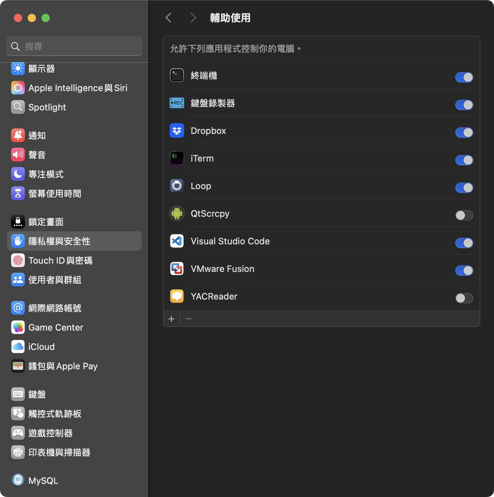

## [簡易鍵盤錄製器](https://v2.tauri.app/plugin/file-system/)

## [安裝執行](https://william-weng.github.io/tags/rust/)
```bash
brew install node
brew install rust
npm install
npm run tauri build
```

## 要加入隱私權設定



## 快速鍵
- CONTROL + SHIFT + S => 開始 / 停止錄製
- CONTROL + SHIFT + P => 執行回放

## 範例

https://github.com/user-attachments/assets/e82758ee-68f8-4155-9bd0-760c04f2bf56