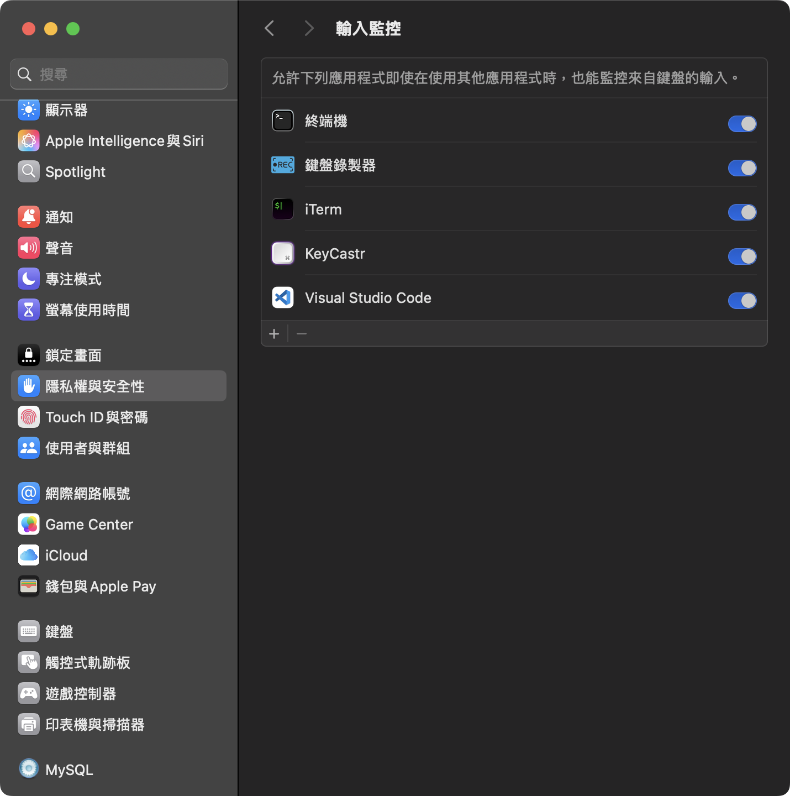

## [簡易鍵盤錄製器](https://v2.tauri.app/plugin/file-system/)

## [安裝執行](https://william-weng.github.io/tags/rust/)
```bash
brew install node
brew install rust
npm install
npm run tauri build
```

## 要加入隱私權設定




## 範例

https://github.com/user-attachments/assets/09640d42-1e9a-4992-91c1-639a00091482
